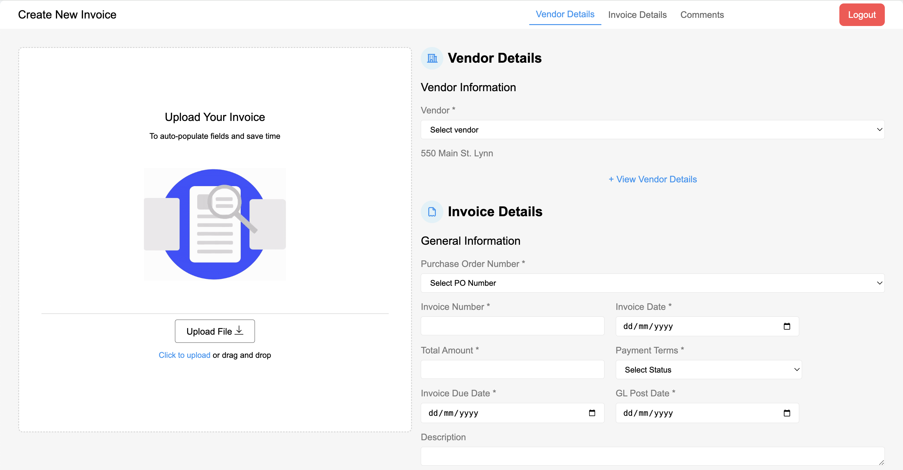

# Invoice Application

This is a React-based(Vite). It uses Formik for form handling, Yup for validation, and React Router for navigation.

## Screenshot

### `npm run dev`

Runs the app in the development mode.\
Open [http://localhost:5173](http://localhost:5173/) to view it in your browser this use Vite.

## Features

- User authentication (login/logout)
- Invoice management
- PDF upload and preview
- Form validation
- Dummy data population

## How to run this project

- do 'npm install' for adding node module and dependencies
- then Run 'npm run dev' to run the project

## Installation

Please ensure you have the following installed and setup:

- React
- Formik
- Yup
- React Router
- React PDF
